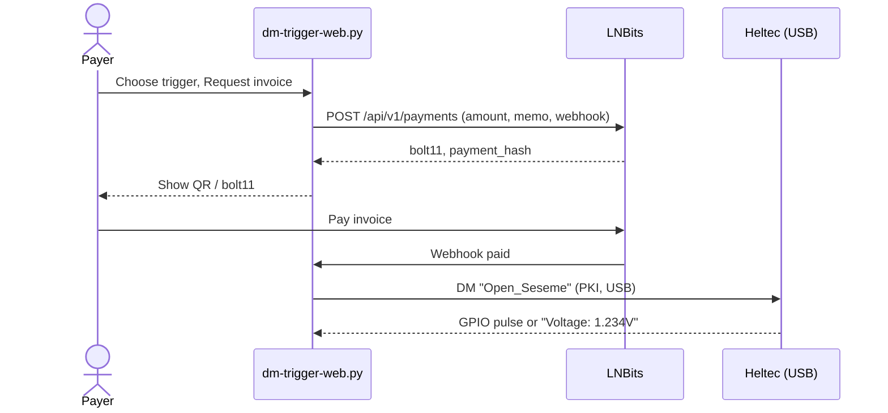
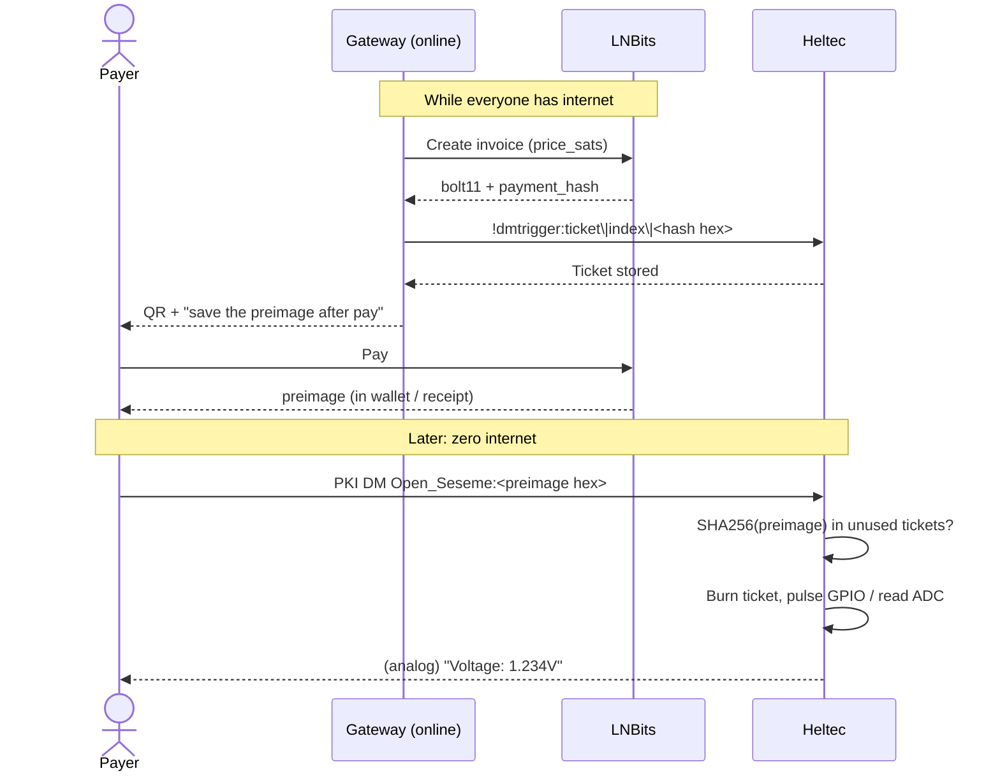

# Lightning-gated DM GPIO triggers

Status: **implemented** (Phase A gateway + Phase B firmware tickets).  
Audience: firmware + the local web GUI (`bin/dm-trigger-web.py`).  
Depends on: [docs/dm-triggers.md](dm-triggers.md).

This document specifies how **Lightning** sits in front of the existing Heltec V3/V4 feature: a PKI-encrypted Meshtastic DM pulses a GPIO or returns an analog voltage. Lightning is a **payment ticket**. It does not encrypt the DM (Meshtastic PKI already does) and it does not run on the ESP32.

## 1. Goals

| Goal | How |
| ---- | --- |
| Charge sats to fire a pin or buy a voltage reading | BOLT11 invoice via a gateway (LNBits first) |
| Keep the radio dumb | Heltec still only matches a DM and acts on GPIO/ADC |
| Work with **no internet at trigger time** | Pay while online → carry a 32-byte **preimage** over LoRa later |
| Fit one Meshtastic text DM | Preimage is 64 hex chars; a Cashu/Arkade VTXO blob is not |
| Do not break unpaid triggers | `price_sats = 0` keeps today’s exact-match behaviour |

Non-goals: Lightning node on the Heltec, on-chain settlement, Arkade VTXOs on-device, Cashu tokens in a DM, Ham mode (PKI off).

## 2. Roles

```text
                    internet                         LoRa / USB
 ┌──────────────┐                 ┌─────────────┐                 ┌──────────────┐
 │ Phone wallet │  BOLT11 pay     │   Gateway   │  PKI text DM    │  Heltec V3/V4│
 │ Phoenix/Zeus │ ──────────────► │ LNBits +    │ ──────────────► │ DmTrigger    │
 │              │                 │ dm-trigger  │  USB or mesh    │ GPIO / ADC   │
 └──────────────┘                 │ -web.py     │                 └──────────────┘
                                  └─────────────┘
                                         │
                                         │ webhook: invoice paid
                                         ▼
                                  create/send DM
                                  (plain phrase or phrase:preimage)
```

| Piece | Where it runs | Job |
| ----- | ------------- | --- |
| **Payer** | Phone Lightning wallet | Pays a BOLT11 invoice |
| **Gateway** | PC/Pi with internet (same box as the GUI) | Creates invoices, receives LNBits webhooks, talks USB/TCP to the node |
| **Node** | Heltec, `HAS_DM_TRIGGER` firmware | Matches DM, optional SHA-256(preimage) check, pulses pin or replies voltage |

The Heltec never opens sockets to LNBits. LNBits never speaks LoRa.

## 3. Two operating modes

Implement in order. Phase A is useful alone; Phase B is what makes off-grid payment gating real.

### Phase A — online gateway (no firmware change)

Internet is up **at the moment of payment**. LNBits tells the GUI the invoice is paid. The GUI sends the **existing** trigger phrase (`Open_Seseme` / `Get_Reading`) over USB, exactly as the Test box does today.



**Offline at trigger time:** this mode cannot fire. Use Phase B.

### Phase B — prepaid ticket (firmware + GUI)

Internet is required only to **buy** the ticket. The GPIO action itself is a LoRa DM with no internet.

1. Gateway creates an invoice whose `payment_hash` is `SHA256(preimage)` (normal Lightning).
2. When paid, LNBits (and thus the payer’s wallet) knows the **preimage**.
3. Gateway loads that `payment_hash` onto the Heltec as an unused ticket (`!dmtrigger:ticket|…`).
4. Later, from the field, the payer DMs:

   `Open_Seseme:<64-char lowercase hex preimage>`

5. Firmware finds the trigger by phrase prefix, checks `SHA256(preimage)` against an unused ticket, **burns the ticket**, then runs the GPIO/ADC action.



The preimage is the only Lightning object that belongs on LoRa: 32 bytes, 64 hex characters.

## 4. Message and size budget

PKI text DMs are capped around **200 bytes** on the air (`MESHTASTIC_PKC_OVERHEAD` is 12; GUI already rejects > 200 chars).

| Field | Limit |
| ----- | ----- |
| Trigger phrase (`Trigger.message`) | keep **39** chars + NUL (`kMessageLen = 40`) |
| Separator | single `:` |
| Preimage | exactly **64** hex chars (`[0-9a-f]`) |
| Worst-case DM | `39 + 1 + 64 = 104` chars — fits |

Firmware today copies the payload into `char text[kMessageLen + 16]` (56 bytes) and requires **exact** length match with `trigger.message`. Phase B **must** change that (see §7.2). Do not put BOLT11, Cashu tokens, or VTXOs in the DM.

## 5. Payment rules

For each trigger:

| `price_sats` | Mesh DM that fires it | USB Test box (from == 0) |
| ------------ | --------------------- | ------------------------ |
| `0` (default) | Exact phrase, current behaviour | Exact phrase |
| `> 0` | Phrase + `:` + valid unused preimage only | Exact phrase **or** ticket DM (operator override) |

USB/self DMs skip the ticket check so the existing Test flow keeps working while developing.

**One preimage, one action.** After a successful match the ticket is zeroed on disk. Replay of the same DM is a no-op (log `ticket already spent`).

**Analog cooldown** (`kAnalogReplyCooldownMs = 2000`) still applies after a valid ticket is burned.

Ham mode (`owner.is_licensed`): PKI DMs are disabled; paid mesh tickets are out of scope.

## 6. System design

### 6.1 LNBits (first adapter)

Gateway env (not committed; local `.env` / GUI fields):

```text
LNBITS_URL=https://legend.lnbits.com   # or self-hosted
LNBITS_INVOICE_KEY=<invoice/read key>
LNBITS_WEBHOOK_BASE=https://<reachable-host>/api/lnbits/webhook
```

Invoice create (gateway → LNBits):

```http
POST {LNBITS_URL}/api/v1/payments
X-Api-Key: {LNBITS_INVOICE_KEY}
Content-Type: application/json

{
  "out": false,
  "amount": 100,
  "unit": "sat",
  "memo": "DM trigger: Garage GPIO7",
  "webhook": "{LNBITS_WEBHOOK_BASE}",
  "extra": {
    "app": "dmtrigger",
    "port": "/dev/ttyUSB0",
    "trigger_index": 0,
    "phrase": "Open_Seseme",
    "mode": "A" 
  }
}
```

`mode` is `"A"` (send phrase on pay) or `"B"` (payer will present preimage over LoRa; gateway only needed to load the hash).

Webhook (LNBits → gateway): JSON including `payment_hash`, `preimage` (once paid), and the `extra` blob. Gateway **must** authenticate (shared secret query param, or listen only on localhost + reverse proxy).

Swap-in later: LND REST, CLN commando, or NWC. Keep an `InvoiceBackend` interface in Python so LNBits is one implementation.

### 6.2 Gateway HTTP API (add to `dm-trigger-web.py`)

| Method | Path | Body | Result |
| ------ | ---- | ---- | ------ |
| GET | `/api/ln/status` | — | `{enabled, backend, configured}` |
| POST | `/api/ln/invoice` | `{port, trigger_index, mode}` | `{bolt11, payment_hash, expires_at}` |
| GET | `/api/ln/invoice/{payment_hash}` | — | `{paid, preimage?}` |
| POST | `/api/lnbits/webhook` | LNBits payload | `{ok}` |
| POST | `/api/ln/load-ticket` | `{port, trigger_index, payment_hash}` | device ack (Phase B) |

Do not expose LNBits admin keys to the browser. The page only displays `bolt11` and paid/unpaid.

### 6.3 GUI

New block on the existing page, under **3. Add / update trigger**:

- Price (sats), default `0`
- Button **Get invoice** (Phase A and B)
- QR of `bolt11`
- Status: unpaid / paid / ticket loaded
- Board picker and USB session unchanged

Phase A: on webhook paid → reuse `monitorSend()` / `sendCommand` with the trigger phrase.  
Phase B: on invoice create → `!dmtrigger:ticket|{index}|{payment_hash hex}`; show “after paying, DM `phrase:<preimage>` from any node.”

## 7. Firmware spec (Phase B)

All of this is behind `HAS_DM_TRIGGER`. Phase A ships with **zero** C++ changes.

### 7.1 Data model

Extend `DmTriggerModule::Trigger` (RAM + `/prefs/dm_triggers.bin`):

```cpp
static constexpr uint8_t kMaxTickets = 8;   // unused hashes per trigger

struct Ticket {
    uint8_t paymentHash[32]{};              // SHA256(preimage); all-zero = empty slot
};

struct Trigger {
    // existing fields…
    uint32_t priceSats = 0;                 // 0 = unpaid / open phrase
    Ticket tickets[kMaxTickets]{};
};
```

Persist file:

- Keep magic `0x444D5452` (`DMTR`).
- Bump `kStateVersion` **1 → 2**.
- On load of v1 files: copy old fields, `priceSats = 0`, tickets empty (do not clobber).
- Reject unknown versions (same “invalid file, do not install defaults” policy as today).

Packed v2 record size must stay small; 8 × 32 B tickets × 8 triggers = 2 KiB plus existing fields — fine on ESP32.

### 7.2 Receive path (`handleReceived`)

Replace the 56-byte stack buffer with a buffer of **201** bytes (200 payload + NUL). Trim CR/LF/space as today.

Matching, in order, per enabled trigger:

1. If `priceSats == 0` **or** `isFromUs(&mp)` / `mp.from == 0`:  
   exact case-insensitive match of `trigger.message` (current code).
2. Else require:

   ```text
   text == trigger.message + ':' + 64 hex chars
   ```

   Case-insensitive phrase; hex **normalized to lowercase**. Decode 32 bytes.  
   `SHA256(preimage)` must equal some `tickets[j].paymentHash`. On success, `memset` that ticket to 0, `saveToDisk()`, then `handleTriggerAction`.
3. If `priceSats > 0` and the DM is exact phrase with **no** preimage and not USB: log and ignore (do not pulse).

Use the existing crypto SHA-256 already in the firmware (`CryptoEngine` / rweather), not a new library.

`!dmtrigger:` config commands are unchanged in authorization (USB or `admin_key`).

### 7.3 New config commands

Same pipe-delimited style as `set|del|list|clear`. Authorized senders only.

| Command | Meaning |
| ------- | ------- |
| `!dmtrigger:price\|<index>\|<sats>` | Set `priceSats`. `0` disables tickets. |
| `!dmtrigger:ticket\|<index>\|<64 hex hash>` | Insert hash into first empty ticket slot. Fail if table full or duplicate. |
| `!dmtrigger:unticket\|<index>\|<64 hex hash>` | Remove that unused hash (refund / cancel before spend). |
| `!dmtrigger:tickets\|<index>` | Reply with count unused + truncated hashes (debug). |

`set|` remains the GPIO/phrase editor. Do **not** cram 64-byte hashes into the existing `set|` line (it would blow the 192-byte parse buffer).

`list` should append `price=<sats> tickets=<n>` per row so the GUI can refresh without a new parser if space allows; if the 220-byte reply fills, keep `list` as today and use `tickets|`.

### 7.4 Crypto and validation

- Hex decode: reject odd length, non-hex, all-zero hash, all-zero preimage.
- Constant-time `memcmp` for hash compare.
- No BOLT11 parser on device.
- No clock / invoice expiry on device. Expiry is a gateway policy (don’t load a hash for a lapsed unpaid invoice). If a hash was loaded and never paid, `unticket` it from USB.

## 8. Python spec (both phases)

New modules (keep `dm-trigger-web.py` as the HTTP + serial process):

| File | Responsibility |
| ---- | ---------------- |
| `bin/ln/backend.py` | `InvoiceBackend` protocol: `create_invoice(amount_sats, memo, extra) -> Invoice`, `parse_webhook(body) -> PaidEvent` |
| `bin/ln/lnbits.py` | LNBits implementation |
| `bin/ln/tickets.py` | hex helpers, `sha256(preimage)`, phrase+preimage formatting |

`Invoice` dataclass: `payment_hash: str`, `bolt11: str`, `expires_at: float`.  
`PaidEvent`: `payment_hash`, `preimage`, `extra: dict`.

In-memory map `payment_hash → {port, trigger_index, phrase, mode}` until paid or expired (do not persist secrets in the repo; optional `~/.meshtasticd/ln-pending.json` is OK).

Serial: reuse the existing session lock. One LN webhook must not race `list`/`set` on the same port (same rule as today: one user of the serial port).

## 9. Implementation order

1. **Docs** — this file.
2. **Phase A (Python):** LNBits adapter, `/api/ln/*`, GUI price + QR, poll/webhook → USB phrase DM.
3. **Phase B firmware:** v2 prefs, 201-byte RX buffer, prefix+preimage match, ticket commands, SHA-256.
4. **Phase B GUI:** after invoice create, `ticket|` load; show field DM recipe after pay.
5. Tests: `python3 bin/ln/test_tickets.py`. Hardware: pay 1 sat via LNBits, confirm GPIO; then send `phrase:<preimage>` from a second node with the PC offline.

### Run Lightning in the GUI

```bash
export LNBITS_URL=https://legend.lnbits.com   # or your instance
export LNBITS_INVOICE_KEY=...                 # invoice/read key
# optional, if LNBits can reach this PC:
export LNBITS_WEBHOOK_BASE=http://127.0.0.1:8088/api/lnbits/webhook
.venv/bin/python bin/dm-trigger-web.py --port 8088
```

If the webhook is not reachable, the page polls LNBits until the invoice is paid.

## 10. Failure table

| Symptom | Likely cause |
| ------- | ------------ |
| Invoice never paid | LNBits URL/key, webhook not reachable from LNBits (use localhost SSH tunnel or a public LNBits) |
| Paid but pin does not move (A) | Serial lock, wrong trigger phrase, node not this fork |
| Ticket DM ignored (B) | Hash never loaded, already burned, uppercase hex not normalized, phrase mismatch, `price_sats==0` still on exact-match path |
| Analog DM with no reply | PKI: destination has no pubkey in NodeDB; or cooldown |
| Prefs lost after flash | v2 file rejected — check `kStateVersion` load path |

## 11. Why not VTXOs here

Arkade VTXOs and Cashu tokens are gateway-side wallets. They do not fit in one DM and they do not give the ESP32 a 32-byte receipt. If the PC later holds Bitcoin via Arkade, it can still create a Lightning invoice (Arkade→LN swap) and this spec stays unchanged.

## 12. Coding checklist

Firmware (`src/modules/DmTriggerModule.*`):

- [x] `kRxTextMax = 200`
- [x] `kMaxTickets = 8`, `Ticket.paymentHash[32]`
- [x] `priceSats` on `Trigger`
- [x] prefs v2 + v1 migrate
- [x] `handleReceived` exact vs `phrase:preimage`
- [x] `ticket` / `unticket` / `price` / `tickets` commands
- [x] USB bypass for price > 0
- [x] burn ticket + `saveToDisk` before GPIO/ADC

Python:

- [x] `InvoiceBackend` + LNBits
- [x] webhook authenticated
- [x] GUI QR + price field
- [x] Phase A: webhook → existing send path
- [x] Phase B: `!dmtrigger:ticket|…` and copyable `phrase:preimage`

Do not implement Lightning inside `CryptoEngine` packet encryption. Tickets are application payload on `TEXT_MESSAGE_APP` only.
